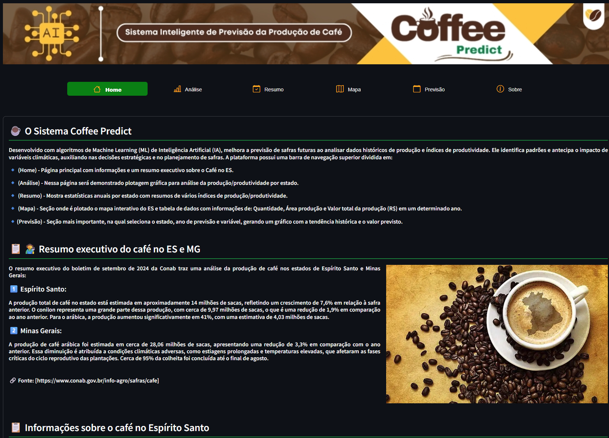
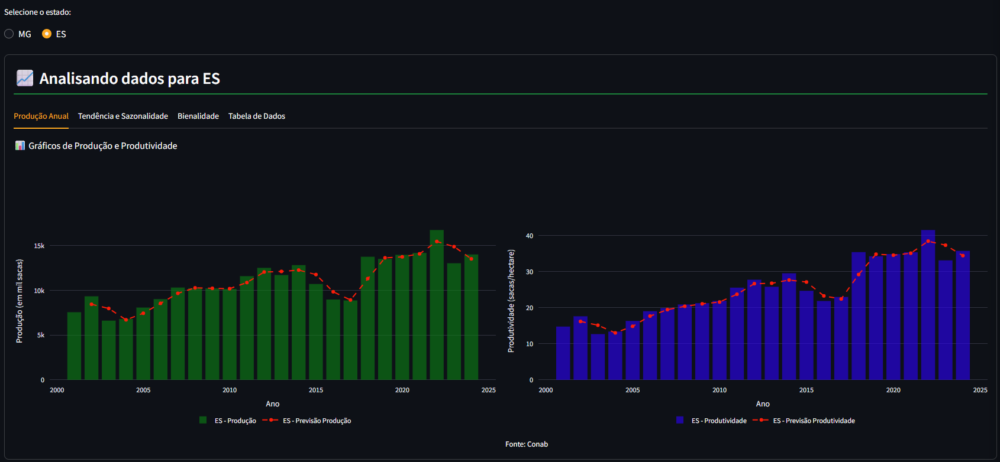
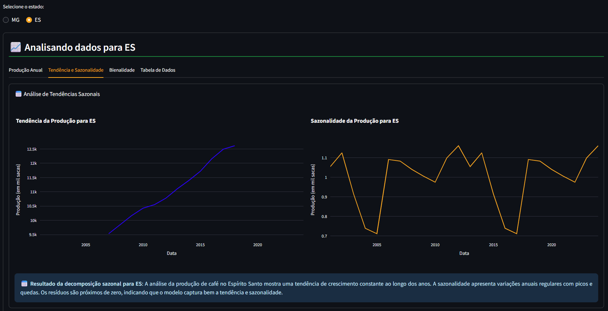
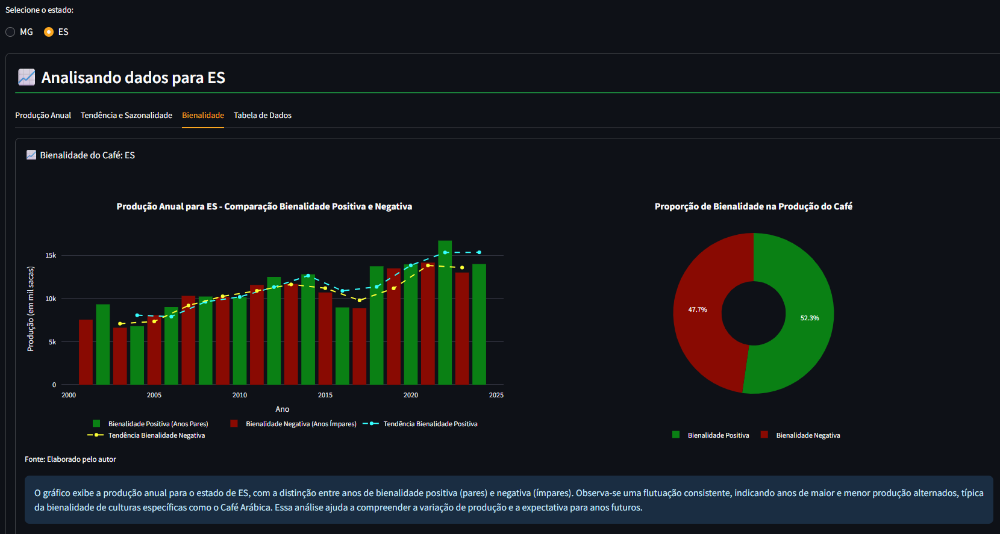
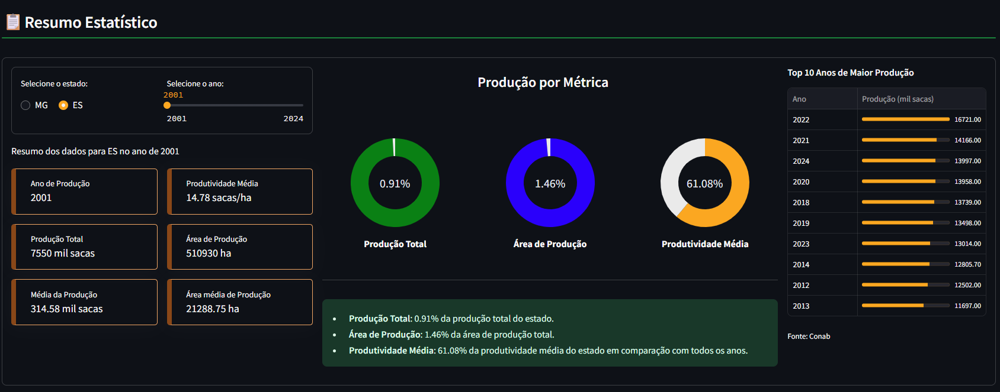
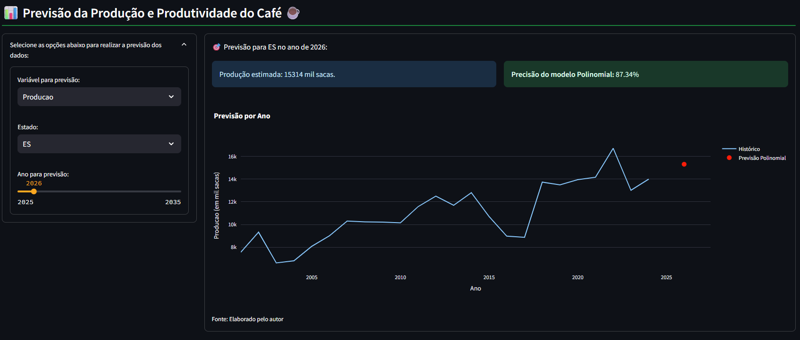
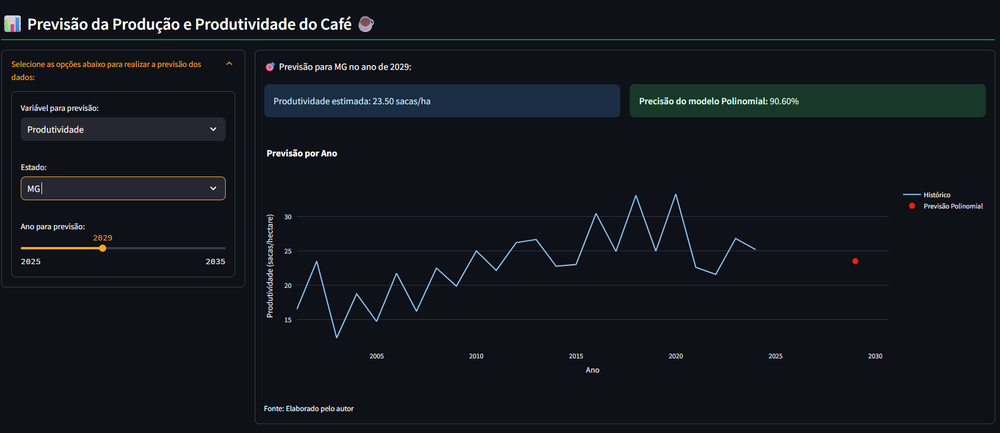

# ☕ Coffee Predict

**Coffee Predict** é uma solução de **Machine Learning aplicada ao Agronegócio**, desenvolvida para realizar **previsões inteligentes da produção de café arábica por cidade do ES**, apoiando o planejamento agrícola com base em dados históricos climáticos e produtivos.

O projeto transforma dados agrícolas dispersos em **insights acionáveis**, reduzindo incertezas e apoiando decisões estratégicas no campo.

---

## 🌱 Visão Geral

- Previsão de produção de café arábica por cidade
- Modelos de regressão aplicados ao agronegócio
- Análise estatística geolocalizada
- Visualizações claras e interpretáveis
- Interface simples voltada ao uso prático

---

## 🔎 Contexto

Produtores de café enfrentam incertezas relacionadas a:

- Variabilidade climática  
- Características do solo  
- Oscilações de mercado  
- Histórico irregular de produtividade  

Muitas decisões agrícolas ainda são tomadas sem apoio analítico estruturado, resultando em:

- 📉 Maior risco de perdas financeiras  
- 🌾 Uso ineficiente de recursos  
- 📅 Dificuldade no planejamento de safras  
- 📊 Baixa previsibilidade produtiva  

O **Coffee Predict** surge para reduzir essas incertezas por meio de modelagem preditiva baseada em dados históricos.

---

## 🤖 Solução

O Coffee Predict é um sistema de **análise preditiva agrícola** que utiliza:

- Dados climáticos históricos  
- Dados de solo  
- Histórico de produção por cidade  

Por meio de técnicas de **regressão e aprendizado supervisionado**, o sistema gera previsões confiáveis de produtividade agrícola.

A solução disponibiliza os resultados em uma interface intuitiva, permitindo que produtores e planejadores visualizem previsões de forma clara e acessível.

---

## 🖥️ Interface do Sistema

<p align="left">
  
  
</p>

<p align="left">
  
  
</p>

<p align="left">
  
  
</p>

---

## 📊 Modelo Preditivo

<p align="left">
  
  
</p>

## ⚙️ Arquitetura Analítica

A arquitetura do sistema é composta por módulos especializados:

### DataPreparationModule
Responsável por tratar, organizar e padronizar dados climáticos e produtivos.

### RegressionModelEngine
Aplica modelos de regressão e técnicas de Machine Learning para previsão da produção.

### GeoAnalysisModule
Realiza análises geolocalizadas por cidade e região produtora.

### PredictionVisualizationModule
Apresenta indicadores e previsões de forma visual e interpretável.

Essa estrutura garante previsões consistentes, replicáveis e compreensíveis.

### Pipeline de dados
<p align="left">
  
 </p>

---

## 🔁 Fluxo Analítico

1. Coleta e preparação dos dados agrícolas  
2. Análise estatística e modelagem preditiva  
3. Geração das previsões de produtividade  
4. Visualização dos resultados  
5. Apoio ao planejamento de safra  

---

## 📊 Resultados Esperados

A adoção do Coffee Predict possibilita:

- 🎯 Acurácia superior a 85% nas previsões  
- 📅 Melhor planejamento agrícola  
- 📉 Redução de perdas e desperdícios  
- 🌍 Uso mais eficiente de recursos naturais  
- 🤝 Impacto econômico positivo no agronegócio  

---

## 🧠 Tecnologias Utilizadas

- **Python**
- **Scikit-learn**
- **Pandas**
- **NumPy**
- **Streamlit**

---

## 🖥️ Interface

O sistema utiliza **Streamlit** para fornecer:

- Interface simples e intuitiva  
- Visualização clara de indicadores  
- Navegação acessível para produtores  
- Exibição das previsões por cidade  

---

## ⚙️ Como Executar o Projeto

1. Clone o repositório:

```bash
git clone https://github.com/seu-usuario/coffee-predict.git
